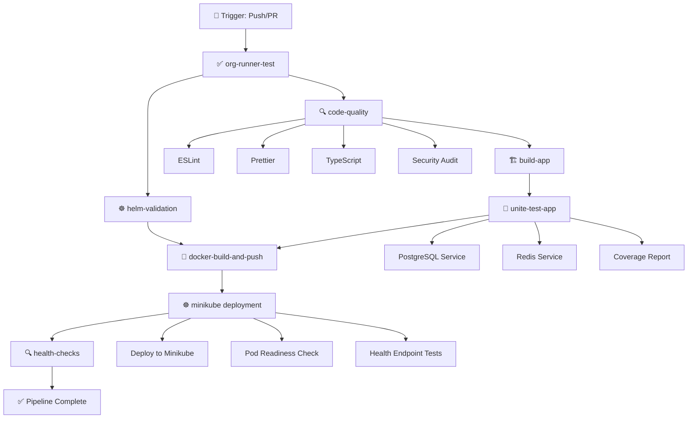
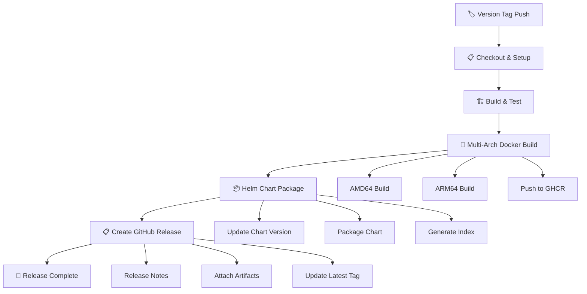
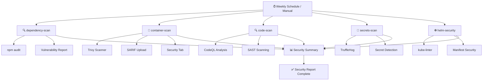
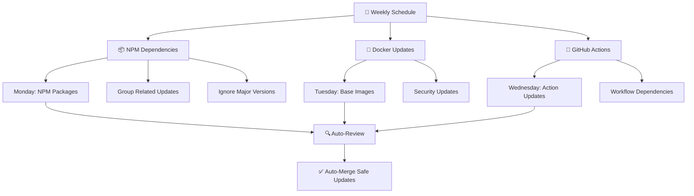

# GitHub Actions CI/CD Pipeline

This directory contains the complete CI/CD pipeline for the Visiobook Core
Database Service, designed to follow the organization's established patterns
while providing enterprise-grade automation.

## 🚀 Workflows Overview

### 1. **Main CI Pipeline** (`.github/workflows/ci.yml`)



**Pipeline Stages:**

1. **Organization Runner Test** - Validates runner availability
2. **Code Quality** - ESLint, Prettier, TypeScript checking, security audit
3. **Build Application** - TypeScript compilation, Prisma client generation
4. **Unit Tests** - Jest tests with PostgreSQL/Redis services, coverage
   reporting
5. **Helm Validation** - Chart linting and template validation
6. **Docker Build & Push** - Multi-platform container builds to GHCR
7. **Minikube Deployment** - End-to-end deployment testing with health checks

### 2. **Release Automation** (`.github/workflows/release.yml`)



### 3. **Security Scanning** (`.github/workflows/security.yml`)



### 4. **Dependency Management** (`.github/dependabot.yml`)



## 🔧 Configuration

### Required Secrets

- `GITHUBTOKEN` - GitHub Container Registry access (already configured)

### Optional Integrations

- **Codecov** - Test coverage reporting (token required for private repos)
- **Slack/Teams** - Notification webhooks (can be added to workflows)

## 📊 Pipeline Features

### **Performance Optimizations**

- **Smart Caching** - Node.js dependencies, Docker layers, Helm charts
- **Parallel Execution** - Independent jobs run simultaneously
- **Conditional Execution** - Skip unchanged components
- **Resource Optimization** - Efficient runner usage

### **Quality Gates**

- **Code Quality** - ESLint, Prettier, TypeScript strict mode
- **Test Coverage** - 80% threshold enforcement
- **Security Scanning** - Multiple vulnerability detection layers
- **Helm Validation** - Chart linting and Kubernetes manifest validation

### **Security Features**

- **Dependency Scanning** - npm audit with automated reporting
- **Container Security** - Trivy vulnerability scanning
- **Code Analysis** - GitHub CodeQL static analysis
- **Secret Detection** - TruffleHog credential scanning
- **Kubernetes Security** - kube-linter best practices

## 🚀 Usage Examples

### **Triggering CI Pipeline**

```bash
# Push to main branch
git push origin main

# Create pull request
git push origin feature/new-feature
gh pr create --title "Add new feature" --body "Description"
```

### **Creating a Release**

```bash
# Create and push a version tag
git tag v1.2.3
git push origin v1.2.3

# Release workflow will automatically:
# 1. Build and test the application
# 2. Create multi-arch Docker images
# 3. Package Helm chart
# 4. Create GitHub release with artifacts
```

### **Manual Security Scan**

```bash
# Trigger security workflow manually
gh workflow run security.yml
```

## 📋 Workflow Status

### **CI Pipeline Jobs**

| Job                     | Purpose                  | Dependencies                        |
| ----------------------- | ------------------------ | ----------------------------------- |
| `org-runner-test`       | Validate runner          | None                                |
| `code-quality`          | Lint, format, type check | `org-runner-test`                   |
| `build-app`             | Compile TypeScript       | `code-quality`                      |
| `unite-test-app`        | Run tests with coverage  | `build-app`                         |
| `helm-validation`       | Validate Helm charts     | `org-runner-test`                   |
| `docker-build-and-push` | Build and push images    | `unite-test-app`, `helm-validation` |
| `minikube`              | Deploy and test          | `docker-build-and-push`             |

### **Security Scan Jobs**

| Job               | Purpose                   | Frequency           |
| ----------------- | ------------------------- | ------------------- |
| `dependency-scan` | Check npm vulnerabilities | Weekly + on changes |
| `container-scan`  | Scan Docker images        | Weekly + on changes |
| `code-scan`       | Static code analysis      | Weekly + on changes |
| `secrets-scan`    | Detect exposed secrets    | Weekly + on changes |
| `helm-security`   | Kubernetes security       | Weekly + on changes |

## 🔍 Monitoring & Debugging

### **Viewing Workflow Results**

- **GitHub Actions Tab** - Real-time pipeline status
- **Security Tab** - Vulnerability reports and SARIF uploads
- **Pull Request Checks** - Inline status and coverage reports
- **Artifacts** - Download build outputs and reports

### **Common Issues & Solutions**

#### **Test Failures**

```bash
# Check test logs in GitHub Actions
# Fix failing tests locally
npm test
npm run test:cov
```

#### **Docker Build Issues**

```bash
# Test Docker build locally
docker build -t test-image ./
docker run --rm test-image
```

#### **Helm Chart Issues**

```bash
# Validate Helm charts locally
helm lint helm/
helm template core-database-service helm/ --dry-run
```

## 📈 Metrics & Reporting

### **Automated Reports**

- **Test Coverage** - Uploaded to Codecov (if configured)
- **Security Vulnerabilities** - GitHub Security tab
- **Build Performance** - GitHub Actions insights
- **Dependency Updates** - Dependabot dashboard

### **Success Criteria**

- ✅ All CI jobs pass
- ✅ Test coverage ≥ 80%
- ✅ No high/critical security vulnerabilities
- ✅ Helm charts validate successfully
- ✅ Docker images build and deploy correctly
- ✅ Health checks pass in Minikube

## 🛠️ Maintenance

### **Regular Tasks**

- **Weekly** - Review Dependabot PRs
- **Monthly** - Update workflow dependencies
- **Quarterly** - Review and optimize pipeline performance
- **As Needed** - Update security scanning tools and configurations

### **Updating Workflows**

1. Make changes to workflow files
2. Test in feature branch
3. Create PR for review
4. Merge to main after approval

This CI/CD pipeline provides enterprise-grade automation while following your
organization's established patterns and conventions.
